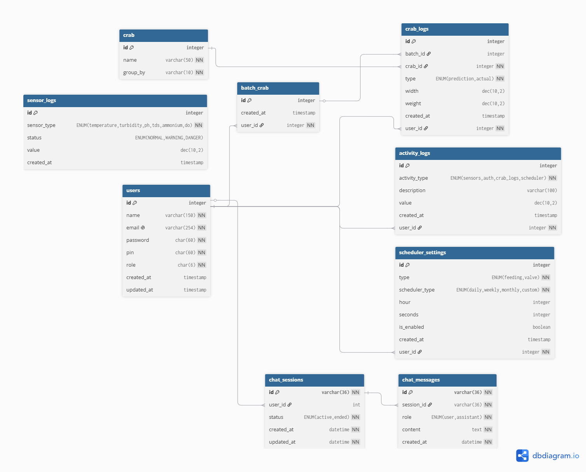

# CrabFarm Backend

Backend server for the **CrabFarm Web Application** built with **FastAPI**.
This service provides API endpoints for managing crab farm data and integrates with the frontend application.

---

## Table of Contents

- [Running with Docker](#running-with-docker)
- [Local Development Setup](#local-development-setup)
- [Database Migration (Alembic)](#database-migration-alembic)
  - [Create a Migration](#create-a-migration)
  - [Apply Migration](#apply-migration)
- [Running the Application](#running-the-application)
  - [Server Parameters](#server-parameters)
- [API Documentation](#api-documentation)
  - [Swagger UI](#swagger-ui)
  - [ReDoc](#redoc)
- [Tech Stack](#tech-stack)
- [Project Structure](#project-structure)
- [Database Design](#database-design)
  - [Entity Relationship](#entity-relationship)
  - [Tables](#tables)
  - [Migration Chain](#migration-chain)
- [Development Notes](#development-notes)
- [License](#license)

---

## Running with Docker

Build and run both the backend and MySQL database using Docker Compose:

```bash
docker compose up --build
# or with Podman:
podman compose up --build
```

This starts:
- **MySQL 8.0** on port `3306`
- **CrabFarm backend** on port `4572`

> Note: The backend container depends on MySQL. Ensure MySQL is ready before hitting the API.

---

## Local Development Setup

### 1. Clone & Enter the Project

```bash
git clone <repo-url>
cd crabfarm-backend
```

### 2. Create a Virtual Environment (Recommended)

```bash
python -m venv venv
source venv/bin/activate    # Linux/macOS
venv\Scripts\activate       # Windows
```

### 3. Install Dependencies

```bash
pip install -r requirements.txt
```

### 4. Configure Environment

Use the existing `.env` file and update values as needed.

---

## Database Migration (Alembic)

This project uses **Alembic** for database version control and migrations.

### Create a Migration

```bash
alembic revision --autogenerate -m "Initial migration"
```

### Apply Migration

```bash
alembic upgrade aefb5bbab48e
```

---

## Running the Application

Start the FastAPI application using **Uvicorn**.

> Note: Replace the host IP with your machine's actual IP address if needed.

```bash
uvicorn App:app --reload --host 0.0.0.0 --port 4572
```

### Server Parameters

| Parameter | Description |
|----------|-------------|
| `--reload` | Automatically reloads the server when code changes |
| `--host` | Host IP address |
| `--port` | Port where the API will run |

---

## API Documentation

FastAPI automatically generates interactive API documentation.

### Swagger UI

```
http://127.0.0.1:4572/docs
```

### ReDoc

```
http://127.0.0.1:4572/redoc
```

---

## Tech Stack

- **FastAPI** – Web framework for building APIs
- **SQLAlchemy 2.0** – ORM for database access
- **MySQL 8.0** – Relational database
- **Alembic** – Database migrations
- **Uvicorn** – ASGI server
- **Docker / Podman / Containers** – Application containerization

---

## Project Structure

```
crabfarm-backend
│
├── App.py                          # FastAPI application entry point
├── .env                            # Environment variables
│
├── database/
│   ├── __init__.py
│   └── database.py                 # SQLAlchemy engine & session config
│
├── models/                         # SQLAlchemy ORM models
│   ├── __init__.py
│   ├── users.py                    # User accounts
│   ├── crab.py                     # Crab definitions
│   ├── crab_logs.py                # Crab growth measurements
│   ├── batch_crab.py               # Batch crab tracking
│   ├── sensor_logs.py              # Water quality sensor readings
│   ├── activity_logs.py            # System activity audit trail
│   ├── scheduler_settings.py       # Feeding/valve schedules
│   ├── chat_sessions.py            # AI chat session
│   └── chat_messages.py            # AI chat messages
│
├── routers/                        # API route handlers
│   ├── __init__.py
│   ├── auth.py
│   ├── crabs.py
│   ├── control.py
│   ├── settings.py
│   ├── activity_logs.py
│   ├── chat.py
│   ├── gateway.py
│   ├── prediction.py
│   └── websockets.py
│
├── services/                       # Business logic layer
│   ├── __init__.py
│   ├── jwt_manager.py              # JWT token handling
│   ├── esp32_config.py             # ESP32 device config
│   ├── scheduler_manager.py        # Scheduling engine
│   ├── sensor_analyzer.py          # Sensor data analysis
│   ├── crab_prediction.py          # Crab growth prediction
│   ├── chat_manager.py             # AI chat orchestration
│   ├── web_sockets.py              # WebSocket connection manager
│   ├── model/
│   │   └── crab_model.pt           # ML model for prediction
│   ├── train/
│   │   └── crab_logs Mar 23 - Mar 29 2026.csv
│   └── agents/
│       ├── __init__.py
│       └── prompts/
│           ├── __init__.py
│           ├── intentions_prompt.py
│           ├── knowledge_prompt.py
│           ├── log_query_prompt.py
│           └── sensor_analyze_prompt.py
│
├── alembic/                        # Database migrations
│   ├── env.py
│   ├── script.py.mako
│   ├── README
│   └── versions/
│       ├── fb3179d6205f_migration_table.py                        # Initial schema
│       ├── 33e05a5b7d66_migration_seeder.py                       # Seed data
│       ├── 24e806715c23_your_new_tables.py                        # Additional seed
│       ├── aefb5bbab48e_activity_logs_tables.py                   # Activity logs
│       ├── c1c5697e9d49_sensor_logs.py                            # Sensor logs
│       ├── 42e606fb8efe_chats_tables.py                           # Chat tables
│       ├── 3b6a664a5903_update_schema.py                          # Schema update
│       └── ee46f37f7890_make_activity_logs_user_id_nullable.py    # Make user_id nullable
│
├── docs/
│   ├── diagram/
│   │   └── database-design.png     # ER diagram
│   └── erd/
│       └── ERD.md                  # Entity relationship docs
│
├── tests/                          # Test suite
│   ├── __init__.py
│   ├── conftest.py
│   ├── test_activity_logs.py
│   ├── test_auth.py
│   ├── test_chat.py
│   ├── test_crabs.py
│   ├── test_prediction.py
│   └── test_settings.py
│
├── compose.yaml                    # Docker Compose (app + MySQL)
├── compose.debug.yaml              # Docker Compose debug
├── Dockerfile                      # Container build
├── pyproject.toml                  # Python project config
├── requirements.txt                # Python dependencies
├── alembic.ini                     # Alembic configuration
├── AGENTS.md                       # AI coding agent instructions
├── ARCHITECTURE.md                 # System architecture docs
└── COMMIT.md                       # Commit conventions
```

---

## Database Design

The system uses **MySQL 8.0** with **SQLAlchemy 2.0 ORM** across **9 tables**.



Full ERD documentation with relationships: [docs/erd/ERD.md](docs/erd/ERD.md)

### Entity Relationship

```
users 1---* chat_sessions 1---* chat_messages
  |
  | (FK nullable)

crab 1---* crab_logs *---1 batch_crab
crab_logs *---1 users

users 1---* activity_logs
users 1---* batch_crab
users 1---* scheduler_settings
```

### Tables

#### `users`
| Column | Type | Constraints |
|--------|------|-------------|
| `id` | INTEGER | PK, auto-increment |
| `name` | VARCHAR(150) | NOT NULL |
| `email` | VARCHAR(254) | UNIQUE, NOT NULL |
| `password` | VARCHAR(60) | NOT NULL |
| `pin` | VARCHAR(60) | NOT NULL |
| `role` | VARCHAR(6) | NOT NULL |
| `created_at` | TIMESTAMP | server_default = now() |
| `updated_at` | TIMESTAMP | onupdate = now() |

#### `crab`
| Column | Type | Constraints |
|--------|------|-------------|
| `id` | INTEGER | PK, auto-increment |
| `name` | VARCHAR(50) | UNIQUE, NOT NULL |
| `group_by` | VARCHAR(10) | NOT NULL |

#### `crab_logs`
| Column | Type | Constraints |
|--------|------|-------------|
| `id` | INTEGER | PK, auto-increment |
| `batch_id` | INTEGER | FK to `batch_crab.id` |
| `crab_id` | INTEGER | FK to `crab.id` |
| `user_id` | INTEGER | FK to `users.id` |
| `type` | ENUM(prediction, actual) | NOT NULL |
| `width` | NUMERIC(10,2) | nullable |
| `weight` | NUMERIC(10,2) | nullable |
| `created_at` | TIMESTAMP | server_default = now() |

#### `sensor_logs`
| Column | Type | Constraints |
|--------|------|-------------|
| `id` | INTEGER | PK, auto-increment |
| `sensor_type` | ENUM(temperature, turbidity, ph, tds, ammonium, do) | NOT NULL |
| `status` | ENUM(NORMAL, WARNING, DANGER) | nullable |
| `value` | NUMERIC(10,2) | nullable |
| `created_at` | TIMESTAMP | server_default = now() |

#### `activity_logs`
| Column | Type | Constraints |
|--------|------|-------------|
| `id` | INTEGER | PK, auto-increment |
| `activity_type` | ENUM(sensors, auth, crab_logs, scheduler) | NOT NULL |
| `description` | VARCHAR(100) | nullable |
| `value` | NUMERIC(10,2) | nullable |
| `user_id` | INTEGER | FK to `users.id`, nullable |
| `created_at` | TIMESTAMP | server_default = now() |

#### `batch_crab`
| Column | Type | Constraints |
|--------|------|-------------|
| `id` | INTEGER | PK, auto-increment |
| `user_id` | INTEGER | FK to `users.id` |
| `created_at` | TIMESTAMP | server_default = now() |

#### `scheduler_settings`
| Column | Type | Constraints |
|--------|------|-------------|
| `id` | INTEGER | PK, auto-increment |
| `type` | ENUM(feeding, valve) | NOT NULL |
| `scheduler_type` | ENUM(daily, weekly, monthly, custom) | NOT NULL |
| `hour` | INTEGER | default = 0 |
| `seconds` | INTEGER | default = 0 |
| `is_enabled` | BOOLEAN | default = false |
| `created_at` | TIMESTAMP | server_default = now() |
| `user_id` | INTEGER | FK to `users.id` |

#### `chat_sessions`
| Column | Type | Constraints |
|--------|------|-------------|
| `id` | VARCHAR(36) | PK (UUID) |
| `user_id` | INTEGER | FK to `users.id`, nullable |
| `status` | ENUM(active, ended) | default = 'active' |
| `created_at` | DATETIME | server_default = now() |
| `updated_at` | DATETIME | onupdate = now() |

#### `chat_messages`
| Column | Type | Constraints |
|--------|------|-------------|
| `id` | VARCHAR(36) | PK (UUID) |
| `session_id` | VARCHAR(36) | FK to `chat_sessions.id`, NOT NULL |
| `role` | ENUM(user, assistant) | NOT NULL |
| `content` | TEXT | NOT NULL |
| `created_at` | DATETIME | server_default = now() |

### Migration Chain

```
fb3179d6205f  (initial schema: users, crab, crab_logs, scheduler_settings, calibration_settings)
       |
33e05a5b7d66  (seed data: admin user + 25 crabs)
       |
24e806715c23  (additional seed data)
       |
aefb5bbab48e  (activity_logs table + last_run column)
       |
c1c5697e9d49  (sensor_logs table)
       |
42e606fb8efe  (chat_sessions + chat_messages tables)
       |
3b6a664a5903  (schema update: batch_crab table, drop calibration_settings, add user_id FKs, column changes)
       |
ee46f37f7890  (make activity_logs.user_id nullable)
```

---

## Development Notes

- Ensure all dependencies are installed before running the server.
- Always run migrations when database models change.
- Use the interactive API docs (`/docs`) to test endpoints.

---

## License

This project is for internal development and deployment of the CrabFarm system.